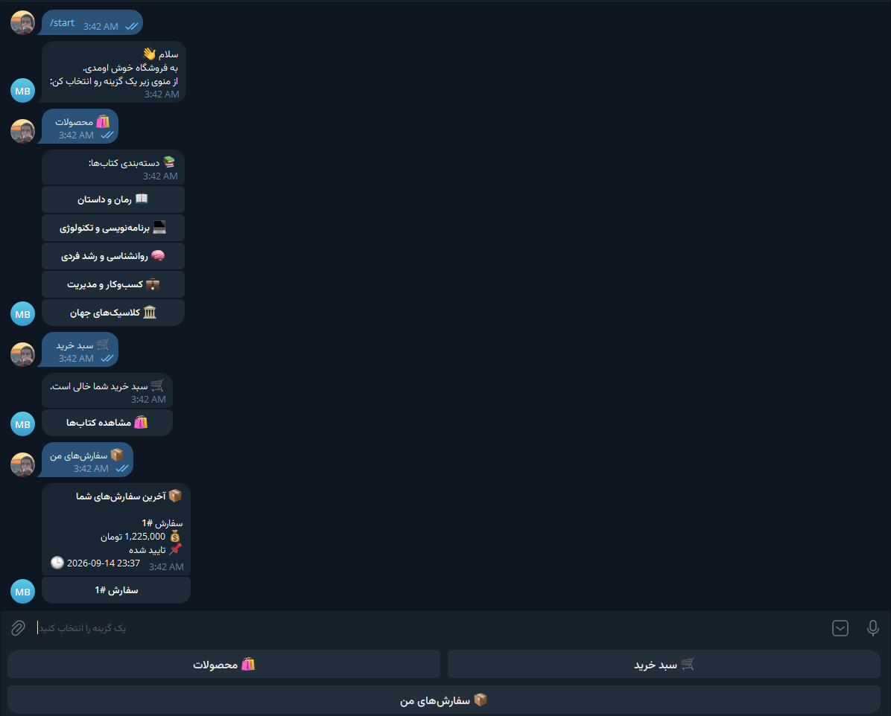
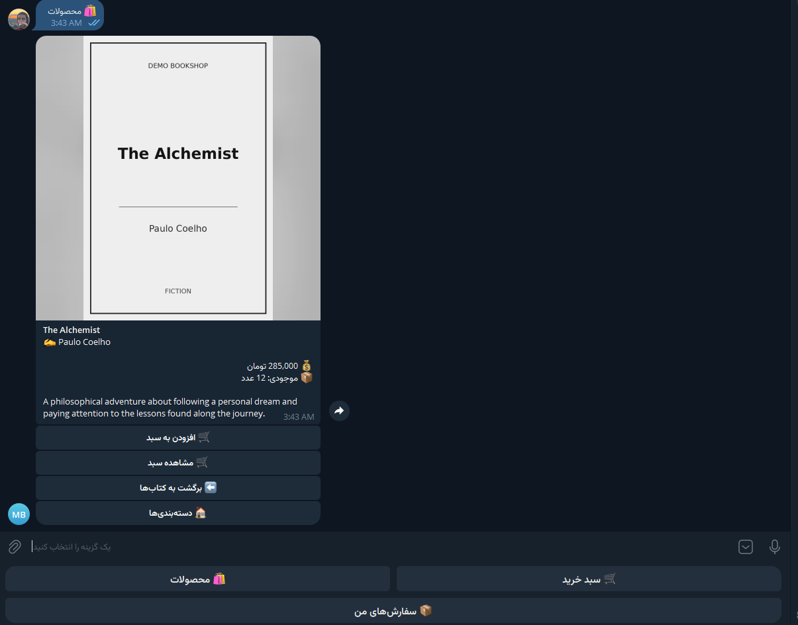
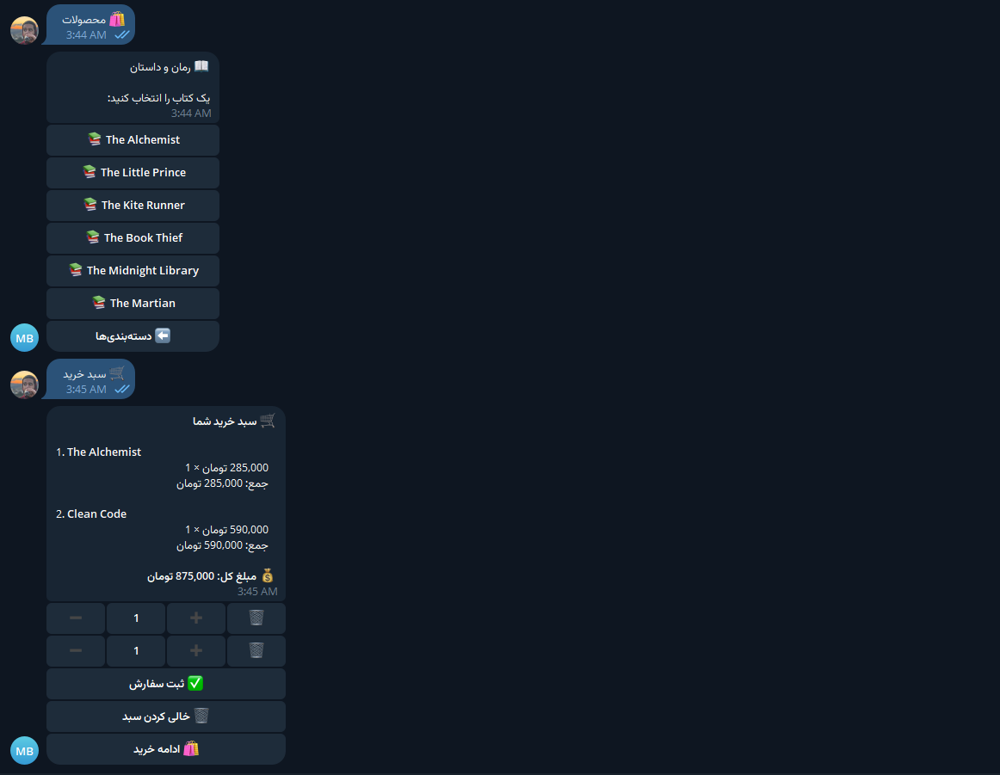

# Telegram Book Shop Bot

A portfolio-ready Telegram shop bot built with **Python**, **Aiogram 3**, **SQLAlchemy**, and **SQLite**.

The project demonstrates a complete small-store workflow inside Telegram: catalog browsing, persistent shopping carts, checkout, order history, stock handling, and an admin panel for managing products, categories, and orders.

> This is a demo/portfolio project. It does **not** use a real payment gateway.

## Screenshots

### Main menu, categories, and order history



### Product details



### Product list and shopping cart



> Screenshots were captured during V1 development; the final build also includes the new Home / Start Over navigation.

## Features

### Customer side

- Private-chat Telegram bot
- Book categories and product catalog
- Product image, author, price, stock, and description
- Persistent cart per Telegram user
- Quantity controls with stock limits
- Cart validation when products/categories become unavailable
- Checkout flow: name → phone → address → review → confirm
- Persistent order history
- Order status notifications
- Main-menu / start-over navigation
- `/start`, `/cancel`, and `/myid` commands

### Admin side

Open the panel with `/admin` from a Telegram user ID listed in `ADMIN_IDS`.

- Add, rename, activate, deactivate, and safely delete categories
- Add and edit products
- Edit product name, author, price, stock, description, category, and image
- Activate/deactivate products
- Safe product deletion
- View recent orders and archived orders
- Order workflow:
  - `pending → confirmed → shipped → completed`
  - `pending → cancelled`
  - `confirmed → cancelled`
- Cancelling an order restores product stock exactly once
- Order deletion is implemented as **archive**, preserving customer/order history
- Customer receives a Telegram message when order status changes

## Safe deletion rules

The project intentionally protects historical data:

- **Product:** hard-deleted only if it has never appeared in an order. Otherwise it is deactivated.
- **Category:** can be deleted only when it contains no products.
- **Order:** archived instead of physically deleted.

This prevents broken order history and foreign-key references.

## Tech stack

- Python 3.10+
- Aiogram 3
- SQLAlchemy 2
- SQLite + aiosqlite
- python-dotenv
- Telegram Bot API
- Long Polling

## Project structure

```text
telegram-shop-bot/
├── app/
│   ├── database/       # models, repositories, SQLite migrations
│   ├── filters/        # admin authorization
│   ├── handlers/       # Telegram update handlers
│   ├── keyboards/      # reply/inline keyboards
│   ├── services/       # cart, orders, admin business logic
│   ├── states/         # Aiogram FSM states
│   ├── config.py
│   ├── logging_config.py
│   └── main.py
├── assets/
│   ├── covers/         # demo book covers
│   └── uploads/        # runtime admin uploads (Git ignored)
├── docs/screenshots/
├── scripts/setup.ps1
├── .env.example
├── requirements.txt
├── setup.bat
├── run.bat
└── README.md
```

## Quick setup on Windows

The easiest setup is:

```text
setup.bat
```

The setup script will:

1. Find Python 3.10+.
2. Download/install Python automatically if it is missing.
3. Create `.venv`.
4. Install `requirements.txt`.
5. Ask for and validate `BOT_TOKEN`.
6. Configure `ADMIN_IDS`.
7. Save a local `.env` file.

Then run:

```text
run.bat
```

Open the bot in Telegram and send:

```text
/start
```

## Getting your Telegram User ID

Send:

```text
/myid
```

The bot replies with your numeric Telegram User ID. Add it to `ADMIN_IDS` in `.env` (or rerun `setup.bat`) to enable the admin panel.

For multiple admins:

```env
ADMIN_IDS=123456789,987654321
```

## Manual setup

```bash
python -m venv .venv
```

Activate the environment and install dependencies:

```bash
pip install -r requirements.txt
```

Copy `.env.example` to `.env` and configure:

```env
BOT_TOKEN=YOUR_TELEGRAM_BOT_TOKEN
ADMIN_IDS=123456789
```

Run:

```bash
python -m app.main
```

## Database

The bot uses:

```text
data/shop.db
```

The database is created automatically on first run and seeded with demo book data.

`data/shop.db` is intentionally ignored by Git. Every clone creates its own local database.

The startup process also applies lightweight SQLite migrations for older versions of this project and enables SQLite foreign-key enforcement.

## Validation and reliability

- Product prices must be greater than `0`.
- Product stock cannot be negative.
- Cart/order quantities must be positive.
- Checkout rechecks product/category availability and stock.
- SQLite foreign keys are enabled on every connection.
- Legacy SQLite databases receive validation triggers during startup.
- Unexpected handler errors are logged and receive a user-friendly Telegram response.
- Runtime logs are stored in `logs/bot.log` and are ignored by Git.

## Security notes

- `.env` is ignored by Git.
- Never commit or share your Telegram Bot Token.
- The admin panel is protected using numeric Telegram User IDs from `ADMIN_IDS`.
- Runtime SQLite data and uploaded admin product images are ignored by Git.
- If a Bot Token is ever committed publicly, revoke/regenerate it with BotFather immediately.

## Demo data

The repository includes sample categories, 30 demo books, and generated demo cover images. These are only starter data for demonstrating the bot.

## Deployment

V1 uses **Long Polling**. It can run locally or on any always-on Windows/Linux machine or VPS.

For 24/7 operation, the process must run on an always-on computer/server. No Docker, Redis, PostgreSQL, or web dashboard is required for this version.

## Current scope

Included:

- Catalog
- Cart
- Checkout
- Orders
- Admin panel
- Inventory updates
- Local image uploads
- Persistent SQLite data

Not included:

- Real payment gateway
- Web admin dashboard
- Shipping API integration
- Production-scale multi-server deployment

## License / use

This repository is intended as a portfolio/demo project and a base for small Telegram commerce bots. Adapt the data model, payment flow, hosting, and security requirements before using it for a real production business.
